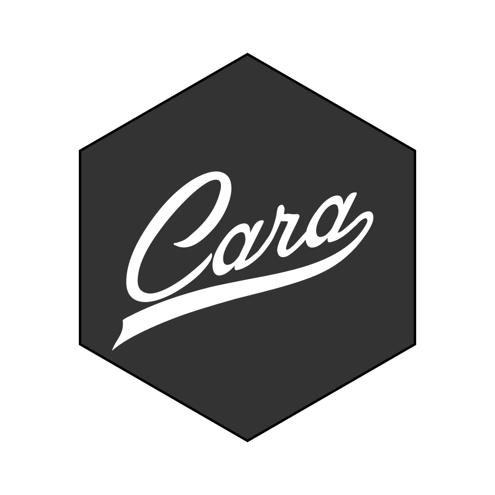

<!-- README.md is generated from README.Rmd. Please edit that file -->

```{r, include = FALSE}
knitr::opts_chunk$set(
  collapse = TRUE,
  comment = "#>",
  fig.path = "man/figures/README-",
  out.width = "100%"
)

library(cara)

#~~~~~~~~~~~~~~~~~~~~~~~~~~~~~~~~~~~~~~~~~~~~~~~~~~~~~~~~~~~~~~~~~~~~~~~~~~~~~
# Generate the pkgdown documentation
#~~~~~~~~~~~~~~~~~~~~~~~~~~~~~~~~~~~~~~~~~~~~~~~~~~~~~~~~~~~~~~~~~~~~~~~~~~~~~
if (FALSE) {
  pkgdown::build_site(
    # devel = TRUE,
    override = list(destination = "../coolbutuseless.github.io/package/cara")
  )
}

if (FALSE) {
  # Check for functions which do not have an @examples block for roxygen
  system("grep -c examples man/*Rd", intern = TRUE) |> 
    grep(":0$", x = _, value = TRUE)
}


if (FALSE) {
  covr::report(covr::package_coverage(
    line_exclusions = c(
      "src/cairo-text-basic.c", 
      "src/cairo-text-glyph.c",
      "src/cairo-params.c",
      "src/color.c"
  )))
}
```


# cara 

<!-- badges: start -->

[](https://CRAN.R-project.org/package=cara)
[](https://github.com/coolbutuseless/cara/actions/workflows/R-CMD-check.yaml)
<!-- badges: end -->


`{cara}` stands for **ca**iro **ra**ster - it is a package for directly drawing on 
an image using the [Cairo](https://www.cairographics.org/) image library as the backend.

## Comparison with [`{nara}`](https://github.com/coolbutuseless/nara)

`{cara}` and [`{nara}`](https://github.com/coolbutuseless/nara) are both 
packages for drawing and manipulating images.

`{cara}` is backed by the [Cairo image library](https://www.cairographics.org/) - 
a C library of battle-tested high-quality image rendering routines.

`{nara}` is backed by the standard R *native raster* format, and the majority of drawing 
routines are bespoke - crafted to operate quickly, but not necessarily for 
high-quality rendering.


Two key characteristices of the packages:

* `{nara}` is much faster.
* `{cara}` does higher quality rendering.


|    |  cara   | nara |
|:---|:--------|:-----|
| Image library |  Cairo   |  bespoke functions |
| Image format  | Cairo surfaces | R's native raster |
| Pixel format  | ARGB           | ABGR |
| Antialiasing  | Yes. Configurable  | No |
| Speed         | Moderate            | Fast |
| Quality       | High. Configuratble | Low  |
| Interactive framerates | Possible. Sometimes | Yes! |

## Installation

You can install from [GitHub](https://github.com/coolbutuseless/cara) with:

``` r
# install.packages('remotes')
remotes::install_github('coolbutuseless/cara')
```


## Demo Rendering

```{r out.width="1200px"}
library(cara)
set.seed(4)
img <- cr_new(1200, 800, 'grey10')
cr_params_set(img, params = cpar(antialias = 'best'))

colors1 <- rainbow(5)
colors2 <- sample(colors(), 5)

xs <- seq(200, 1000, 200)

cr_rect(img, x = xs, y = 150, w = 150, h = 150, fill = colors1, 
        hjust = 0.5, vjust = 0.5)
cr_text_basic(img, x = xs, y = 60, text = colors1, fill = 'white', 
              size = 25, hjust = 0.5)

cr_circle(img, x = xs, y = 350, r = 70, fill = colors2)
cr_text_basic(img, x = xs, y = 350, text = colors2, fill = 'grey0', 
              size = 25, hjust = 0.5, vjust = 0.3)

cr_translate(img, x = 10, y = 435)

N <- 30
colors3 <- topo.colors (N)
pos <- seq(0, 350, length.out = N)
for (i in seq_along(pos)) {
  cr_line(img, x0 = pos[i], x1 = 350, y0 = 0, y1 = pos[i], colors3[i])
  cr_line(img, x0 = 0, x1 = pos[i], y0 = pos[i], y1 = 350, colors3[i])
}

cr_transform_reset(img)

logo_file  <- system.file("img/logo-rainbow.png", package = 'cara', mustWork = TRUE)
logo   <- cr_read_png(logo_file)
cr_blit(img, logo, xscale = 0.5, x =  600, y = 600)

hex_file  <- system.file("img/logo-hex.png", package = 'cara', mustWork = TRUE)
hex <- cr_read_png(hex_file)
cr_blit(img, hex, xscale = seq(0.45, 0.3, length.out = 20), 
        x = 1000, y = 600, 
        angle = seq(-270, 0, length.out = 20))


plot(img, T)
```


## Load image from PNG

```{r fig.height=8, fig.width=10}
logo_file  <- system.file("img/logo-rainbow.png", package = 'cara', mustWork = TRUE)
cr_logo   <- cr_read_png(logo_file)
plot(cr_logo)
```


## Blitting

```{r}
set.seed(1)
N <- 10
scale_max <- 3

w <- 800
h <- 600

logo_file  <- system.file("img/logo-rainbow.png", package = 'cara', mustWork = TRUE)
logo   <- cr_read_png(logo_file)
canvas <- cr_new(w, h, fill = 'grey20')

cr_blit(
  canvas, logo, 
  x      = runif(N, 0, w), 
  y      = runif(N, 0, h), 
  angle  = runif(N, 0, 2*pi),
  xscale = runif(N, 0.1, 0.5)
)


plot(canvas, T)
```


## Related Software

* [`{nara}`](https://github.com/coolbutuseless/nara) - a package for drawing on
  native raster images (a native R format).


